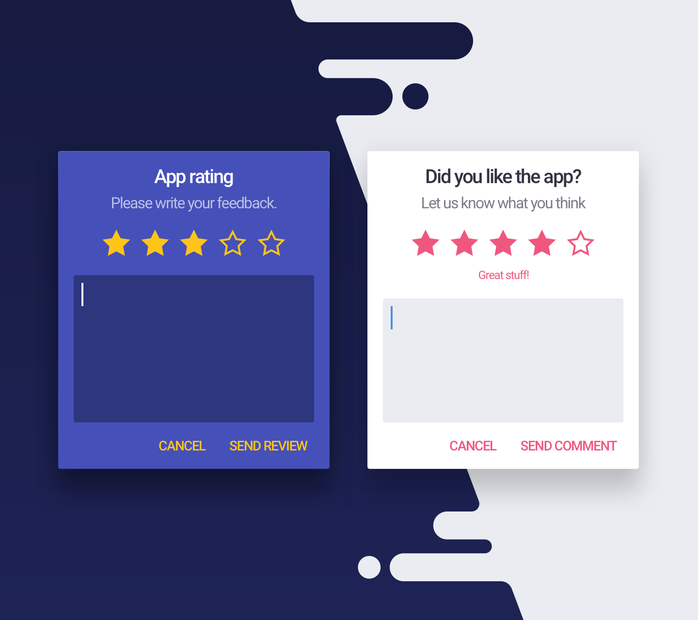
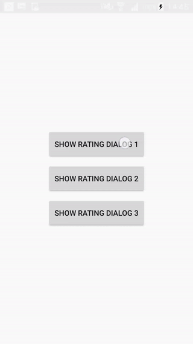
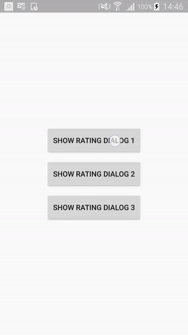

<p align="center">
  
</p>

# Android Material App Rating [](https://travis-ci.org/stepstone-tech/android-material-app-rating) [](https://android-arsenal.com/details/1/6143)[](https://android.libhunt.com/project/android-material-app-rating)

This library allows to use customized Rating Dialog inside applications.



## Download
```groovy
compile 'com.stepstone.apprating:app-rating:2.2.0'
```

## Supported features
  - custom styles for dialog's background, stars, title, description, hint
  - custom rating scope (number of stars)
  - note descriptions below rating bar, which describes each note
  - defining custom dialog's title, description and hint
  - defining text for positive, negative and neutral button
  - enter/exit window animation

### Using different app themes
&nbsp;&nbsp;&nbsp;&nbsp;


## Getting started

### Prepare styling for dialog

Styling app rating dialog works in the same way like styling standard android's AlertDialog.
Just need to define own style for your dialog.
```xml
<?xml version="1.0" encoding="utf-8"?>
<resources>

    <!-- Dialog -->
    <style name="MyAlertDialogStyle" parent="Theme.AppCompat.Light.Dialog.Alert">
        <item name="android:background">@color/backgroundColor</item>
        <item name="buttonBarPositiveButtonStyle">@style/MyAlertDialogButtonStyle</item>
        <item name="buttonBarNegativeButtonStyle">@style/MyAlertDialogButtonStyle</item>
        <item name="buttonBarNeutralButtonStyle">@style/MyAlertDialogButtonStyle</item>
    </style>

    <style name="MyAlertDialogButtonStyle" parent="@style/Widget.AppCompat.Button.ButtonBar.AlertDialog">
        <item name="android:textColor">@color/colorAccent</item>
        <item name="android:textSize">@dimen/text_size_medium</item>
    </style>

    <style name="MyDialogFadeAnimation">
        <item name="android:windowEnterAnimation">@android:anim/fade_in</item>
        <item name="android:windowExitAnimation">@android:anim/fade_out</item>
    </style>

</resources>
```

And assign this style to the theme.
```xml
<?xml version="1.0" encoding="utf-8"?>
<resources>

    <style name="AppTheme" parent="Theme.AppCompat.Light.DarkActionBar">
        <item name="colorPrimary">@color/colorPrimary</item>
        <item name="colorPrimaryDark">@color/colorPrimaryDark</item>
        <item name="colorAccent">@color/colorAccent</item>

        <!-- Assign dialog style here. -->
        <item name="alertDialogTheme">@style/MyAlertDialogStyle</item>
        <item name="alertDialogStyle">@style/MyAlertDialogStyle</item>

        <!-- Assign custom text styles for title, description, comment -->
        <item name="appRatingDialogTitleStyle">@style/MyDialogTitleStyle</item>
        <item name="appRatingDialogDescriptionStyle">@style/MyDialogDescriptionStyle</item>
        <item name="appRatingDialogNoteDescriptionStyle">@style/MyDialogNoteDescriptionStyle</item>
        <item name="appRatingDialogCommentStyle">@style/MyDialogCommentStyle</item>
    </style>

</resources>
```

### Setup and create dialog

This code need to be invoked inside FragmentActivity.
<b>Activity MUST implement RatingDialogListener !</b> Otherwise an exception will be thrown.

```java
private void showDialog() {
        new AppRatingDialog.Builder()
                .setPositiveButtonText("Submit")
                .setNegativeButtonText("Cancel")
                .setNeutralButtonText("Later")
                .setNoteDescriptions(Arrays.asList("Very Bad", "Not good", "Quite ok", "Very Good", "Excellent !!!"))
                .setDefaultRating(2)
                .setTitle("Rate this application")
                .setDescription("Please select some stars and give your feedback")
                .setDefaultComment("This app is pretty cool !")
                .setStarColor(R.color.starColor)
                .setNoteDescriptionTextColor(R.color.noteDescriptionTextColor)
                .setTitleTextColor(R.color.titleTextColor)
                .setDescriptionTextColor(R.color.contentTextColor)
                .setHint("Please write your comment here ...")
                .setHintTextColor(R.color.hintTextColor)
                .setCommentTextColor(R.color.commentTextColor)
                .setCommentBackgroundColor(R.color.colorPrimaryDark)
                .setWindowAnimation(R.style.MyDialogFadeAnimation)
                .create(MainActivity.this)
                .show();
    }
```

### Getting results

Rating and comments can be fetched by listener implemented by activity.

```java
class MyActivity implements RatingDialogListener {

        @Override
        public void onPositiveButtonClicked(int rate, String comment) {
            // interpret results, send it to analytics etc...
        }

        @Override
        public void onNegativeButtonClicked() {

        }
        
        @Override
        public void onNeutralButtonClicked() {

        }
}
```

## Changelog
See [changelog](CHANGELOG.md)

## License
Copyright 2017 StepStone Services

Licensed under the Apache License, Version 2.0 (the "License");
you may not use this file except in compliance with the License.
You may obtain a copy of the License at

&nbsp;&nbsp;&nbsp;&nbsp;[http://www.apache.org/licenses/LICENSE-2.0](http://www.apache.org/licenses/LICENSE-2.0)

Unless required by applicable law or agreed to in writing, software
distributed under the License is distributed on an "AS IS" BASIS,
WITHOUT WARRANTIES OR CONDITIONS OF ANY KIND, either express or implied.
See the License for the specific language governing permissions and
limitations under the License.

## Maintained by
<a href="http://www.stepstone.com"></a>
